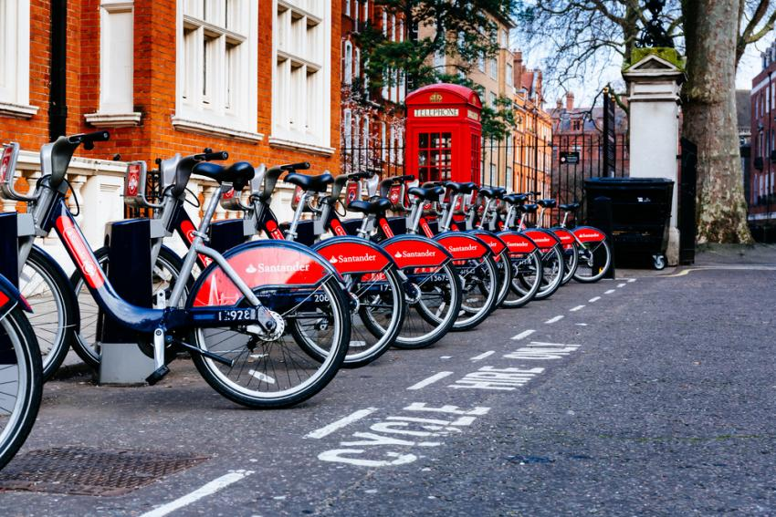

# Predicting Trip Duration for the SF Bay Area Bike Sharing System
USF MSDS Distributed Data System - Group Project 

#### Data: San Francisco Bay Area Bike Share dataset
The Bay Area Bike Share enables quick, easy, and affordable bike trips around the San Francisco Bay Area. 
They make regular open data releases (this dataset is a transformed version of the data from this link), plus maintain a real-time API.
https://www.kaggle.com/benhamner/sf-bay-area-bike-share

#### About this dataset:  

station.csv - Contains data that represents a station where users can pickup or return bikes.  
trips.csv - Data about individual bike trips.  
weather.csv - Data about the weather on a specific day for certain zip codes.  

#### Contributors:

Vivian Chu  
Yao Liu   
Arthur Qin  
Todd Zhang  
Yunzheng Zhao  

#### Goal:

Bike sharing systems have been largely adopted in the Bay Area and emerging as a fast-moving phenomenon. 
According to Wikipedia, one of the major bike-sharing system has about 10,000 annual subscribers, over 2,600 bicycles in 262 stations across San Francisco.
In order to facilitate trip management and optimize user experience, we want to examine how exogenous weather factors' impact on the duration for each trip.

#### Process - Feature Engineering:

1. Cleaning and extracting variables to convert them to numeric values
2. Frequency encoding for some variables
3. One-hot encoding the categorical variables
4. Balanced the dataset 

#### Data Modeling:

Pipeline 
1. Simple Imputer with strategy='median'
2. Models fitted - Regularized Linear Regression, Decision Tree, Random Forest, Gradient Boosting
3. Hyperparameters tuning

#### Model Evaluation:

Compared various fitted model on basis on evaluation of validation set on metric: RMSE

#### Conclusion:

1. Gradient Boost outperformed the other models (Linear Regressions, Random Forest, XGBoost and Gradient Boost) for travel time prediction.  
2. Noises significantly impact results. By dropping misleading outliers, RMSE dropped over 75%. Consider changing evaluation metrics.  
3. Cross Validation on tree-based Spark ML takes long time, potentially due to how Spark ML optimizes splits of continuous variables. (approximating quantile instead of using exact splits)  
4. For Bike Riders : Optimize path according to duration  
5. For Bike Sharing Service Company: maintain the system in a balanced state (optimize docks for different stations)
